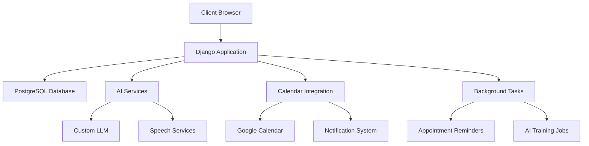
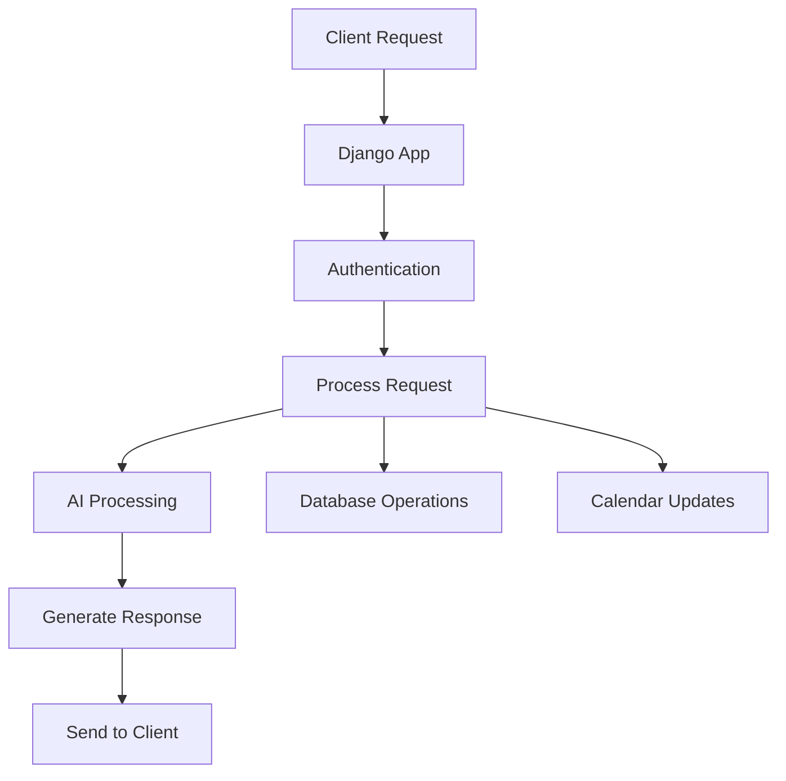
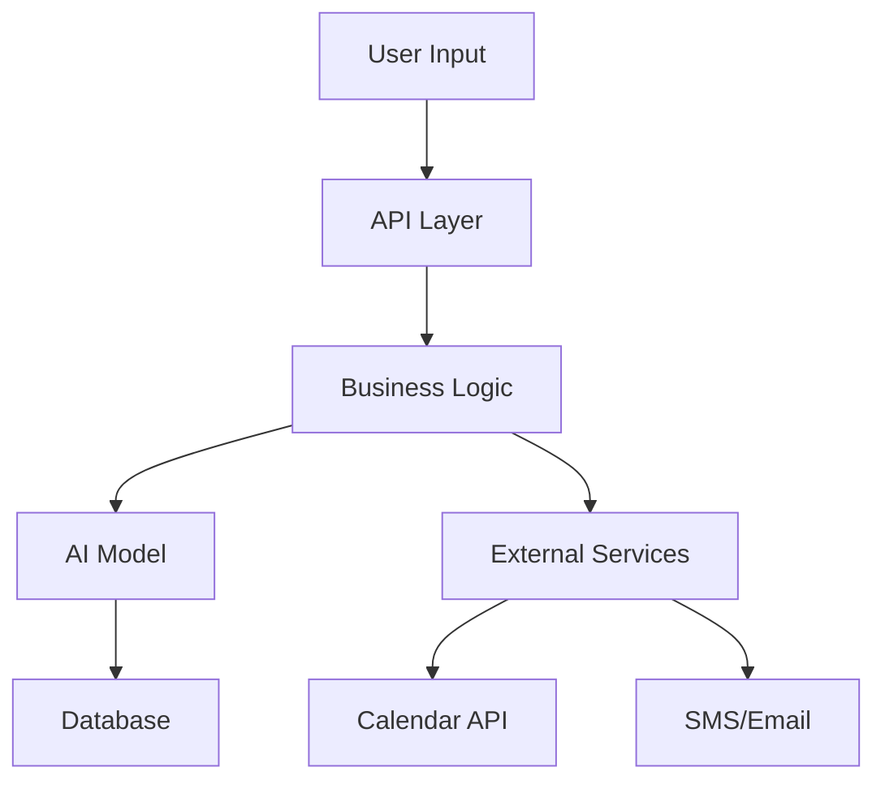
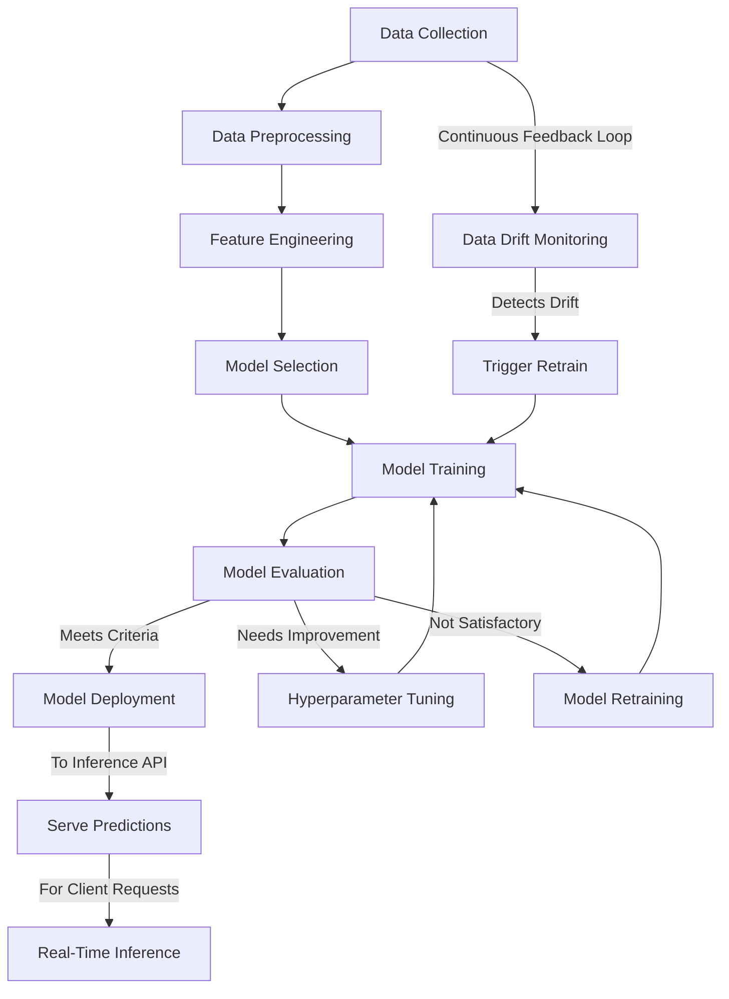
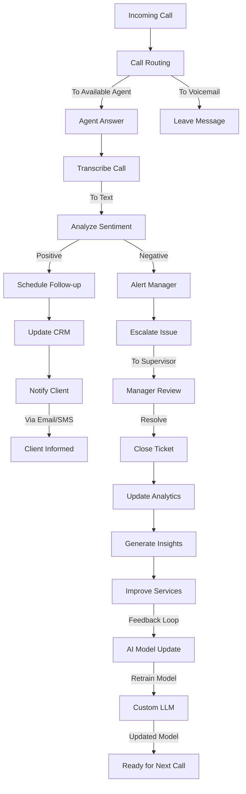
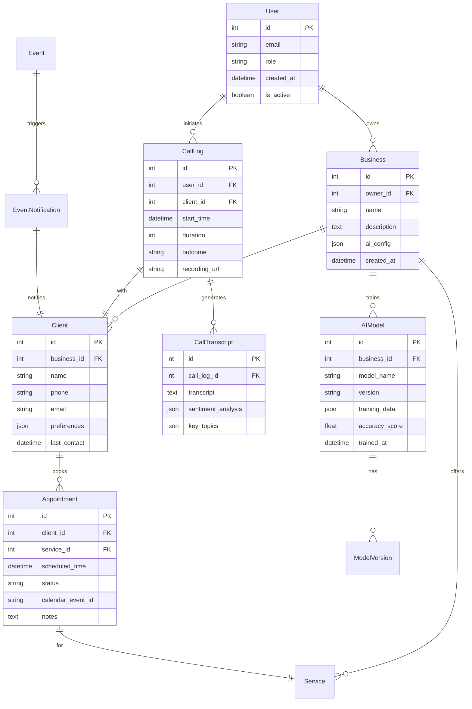

# 🚀 AI-Powered Appointment Management System
> *The Future of Client Engagement is Here*

Transform your business interactions with our cutting-edge AI-driven appointment management platform. Seamlessly blend artificial intelligence with human touch to create extraordinary client experiences.

## 🌟 Revolutionary Features

### 🧠 **Intelligent AI Core**
- **Custom Fine-Tuned LLM**: Personalized AI model trained on your business data
- **Natural Voice Synthesis**: Human-like text-to-speech for authentic conversations
- **Advanced Speech Recognition**: Crystal-clear speech-to-text conversion
- **Smart Call Transcription**: Complete audio-to-text conversion with context awareness

### 📞 **Autonomous Client Outreach**
- **Proactive Event Notifications**: AI automatically contacts clients about upcoming events
- **Intelligent Appointment Booking**: Seamless integration with Google Calendar and other platforms
- **Real-Time Availability Management**: Smart scheduling that prevents double-bookings
- **Follow-up Automation**: Intelligent reminder systems and confirmation workflows

### 📊 **Business Intelligence Dashboard**
- **Call Analytics**: Comprehensive transcript analysis and conversation insights
- **Client Interaction History**: Complete communication timeline for each client
- **Performance Metrics**: Track conversion rates, response times, and engagement levels
- **Revenue Impact Analysis**: Measure the ROI of your AI assistant

### 🔗 **Seamless Integrations**
- **Google Calendar Sync**: Bi-directional calendar integration
- **Multi-Platform Support**: Works with major calendar applications
- **CRM Compatibility**: Easy integration with existing customer management systems
- **API-First Architecture**: Extensible and developer-friendly

## 🏗️ **Architecture & Tech Stack**



### System Workflow



### Data Flow



## **AI Model Training Pipeline**

<details>
<summary>Click to expand training pipeline diagram</summary>



</details>

### **Real-Time Call Processing Flow**

<details>
<summary>Click to expand call processing flow diagram</summary>



</details>

### **Django Application Structure**

```mermaid
graph TD
    subgraph "Django Project Root"
        A[manage.py] --> B[config/]
        B --> C[settings.py]
        B --> D[urls.py]
        B --> E[wsgi.py]
        
        F[apps/] --> G[accounts/]
        F --> H[appointments/]
        F --> I[ai_services/]
        F --> J[integrations/]
        F --> K[analytics/]
        
        G --> G1[models.py - User Management]
        G --> G2[views.py - Authentication]
        G --> G3[serializers.py - API]
        
        H --> H1[models.py - Appointments]
        H --> H2[views.py - Booking Logic]
        H --> H3[tasks.py - Background Jobs]
        
        I --> I1[llm_service.py - AI Model]
        I --> I2[speech_service.py - STT/TTS]
        I --> I3[call_handler.py - Call Logic]
        
        J --> J1[google_calendar.py]
        J --> J2[twilio_service.py]
        J --> J3[email_service.py]
        
        K --> K1[models.py - Analytics Data]
        K --> K2[dashboard.py - Reports]
        K --> K3[metrics.py - KPIs]
    end
    
    subgraph "External Services"
        L[Google Calendar API]
        M[OpenAI/Custom LLM]
        N[Speech Services]
        O[Twilio Voice API]
    end
    
    J1 --> L
    I1 --> M
    I2 --> N
    I3 --> O
    
    style F fill:#e8f5e8
    style I fill:#f3e5f5
    style J fill:#fff3e0
    style K fill:#e1f5fe
```

<details>
<summary>Click to expand Django application structure diagram</summary>



</details>

### **Database Schema Overview**

<details>
<summary>Click to expand database schema diagram</summary>



</details>

### **API Architecture & Endpoints**

<details>
<summary>Click to expand API architecture diagram</summary>

```mermaid
graph TB
    subgraph "API Endpoints"
        A[/api/v1/] --> B[auth/]
        A --> C[appointments/]
        A --> D[clients/]
        A --> E[ai-services/]
        A --> F[analytics/]
        A --> G[integrations/]
    end
    
    subgraph "Authentication Endpoints"
        B --> B1[POST /login]
        B --> B2[POST /register]
        B --> B3[POST /refresh-token]
        B --> B4[POST /logout]
    end
    
    subgraph "Appointment Endpoints"
        C --> C1[GET /appointments/]
        C --> C2[POST /appointments/]
        C --> C3[PUT /appointments/{id}]
        C --> C4[DELETE /appointments/{id}]
        C --> C5[GET /availability/]
    end
    
    subgraph "AI Service Endpoints"
        E --> E1[POST /train-model/]
        E --> E2[POST /initiate-call/]
        E --> E3[GET /call-status/{id}]
        E --> E4[GET /transcripts/]
        E --> E5[POST /speech-to-text/]
        E --> E6[POST /text-to-speech/]
    end
    
    subgraph "Integration Endpoints"
        G --> G1[GET /calendar/events/]
        G --> G2[POST /calendar/sync/]
        G --> G3[GET /call-logs/]
        G --> G4[POST /send-notification/]
    end
    
    style E fill:#f3e5f5
    style G fill:#fff3e0
    style C fill:#e8f5e8
```

</details>

### **Prerequisites**
- Python 3.9+
- PostgreSQL 13+
- Google Cloud Account (for Calendar API)
- OpenAI API access (or alternative LLM provider)

### **Installation**

1. **Clone the Repository**
   ```bash
   git clone https://github.com/yourusername/ai-appointment-system.git
   cd ai-appointment-system
   ```

2. **Environment Setup**
   ```bash
   # Create virtual environment
   python -m venv venv
   source venv/bin/activate  # On Windows: venv\Scripts\activate
   
   # Install dependencies
   pip install -r requirements.txt
   ```

3. **Configuration**
   ```bash
   # Copy environment template
   cp .env.example .env
   
   # Edit .env with your credentials
   nano .env
   ```

4. **Database Setup**
   ```bash
   # Run migrations
   python manage.py migrate
   
   # Create superuser
   python manage.py createsuperuser
   
   # Load sample data (optional)
   python manage.py loaddata fixtures/sample_data.json
   ```

5. **Launch Application**
   ```bash
   python manage.py runserver
   ```

## 🔧 **Configuration**

### **Essential Environment Variables**

```env
# Database Configuration
DATABASE_NAME=ai_appointments
DATABASE_USER=your_db_user
DATABASE_PASSWORD=your_secure_password
DATABASE_HOST=localhost
DATABASE_PORT=5432

# AI Service APIs
OPENAI_API_KEY=your_openai_key
GOOGLE_CLOUD_KEY=your_google_cloud_key
SPEECH_TO_TEXT_API=your_stt_service_key
TEXT_TO_SPEECH_API=your_tts_service_key

# Calendar Integration
GOOGLE_CALENDAR_CLIENT_ID=your_client_id
GOOGLE_CALENDAR_CLIENT_SECRET=your_client_secret

# Security
SECRET_KEY=your_django_secret_key
DEBUG=False

# Communication Settings
TWILIO_ACCOUNT_SID=your_twilio_sid
TWILIO_AUTH_TOKEN=your_twilio_token
```

## 👥 **User Roles & Permissions**

### 🏢 **Business Owner**
- Complete system administration
- AI model fine-tuning controls
- Revenue and analytics dashboard
- User management and permissions

### 👨‍💼 **Staff Manager**
- Appointment oversight and management
- Client communication history
- Calendar coordination
- Performance monitoring

### 👤 **Client Portal**
- Self-service appointment booking
- Personal schedule management
- Communication preferences
- Appointment history and receipts

## 🤖 **AI Model Training**

### **Business Data Integration**
1. **Upload Your Business Data**
   - Service descriptions and pricing
   - Historical client interactions
   - Business policies and procedures
   - FAQ and common responses

2. **Model Fine-Tuning Process**
   ```bash
   python manage.py train_llm --data-path business_data/
   python manage.py validate_model --test-scenarios
   python manage.py deploy_model --version production
   ```

3. **Continuous Improvement**
   - Real-time learning from interactions
   - Performance monitoring and optimization
   - Regular model updates and refinements

## 📊 **Monitoring & Analytics**

### **Real-Time Dashboards**
- Live call monitoring and transcription
- Appointment booking success rates
- Client satisfaction metrics
- System performance indicators

### **Comprehensive Reports**
- Weekly/Monthly business summaries
- Client engagement analysis
- Revenue impact assessments
- AI performance evaluations

## 🔒 **Security & Privacy**

### **Data Protection**
- End-to-end encryption for all communications
- GDPR/CCPA compliance built-in
- Secure API authentication
- Regular security audits and updates

### **Privacy Controls**
- Client consent management
- Data retention policies
- Anonymization options
- Export and deletion tools

## 🚀 **Deployment Options**

### **Development Environment**
```bash
python manage.py runserver
```

### **Production Deployment**
```bash
# Using Gunicorn + Nginx
gunicorn config.wsgi:application --bind 0.0.0.0:8000

# Docker Deployment (Coming Soon)
docker-compose up -d
```

### **Cloud Platforms**
- AWS (Recommended)
- Google Cloud Platform
- Microsoft Azure
- Heroku (for smaller deployments)

## 🛣️ **Roadmap**

### **Version 2.0 (Coming Soon)**
- [ ] Multi-language support
- [ ] Video call integration
- [ ] Advanced AI personalities
- [ ] Mobile app companion

### **Version 3.0 (Future)**
- [ ] Predictive analytics
- [ ] Industry-specific templates
- [ ] White-label solutions
- [ ] Enterprise SSO integration

## 🤝 **Contributing**

We welcome contributions from the community! Here's how you can help:

1. **Fork the Repository**
2. **Create Feature Branch** (`git checkout -b feature/amazing-feature`)
3. **Commit Changes** (`git commit -m 'Add amazing feature'`)
4. **Push to Branch** (`git push origin feature/amazing-feature`)
5. **Open Pull Request**

### **Development Guidelines**
- Follow PEP 8 style guidelines
- Write comprehensive tests
- Update documentation
- Ensure backward compatibility

## 📖 **Documentation**

- [API Documentation](docs/api.md)
- [User Guide](docs/user-guide.md)
- [Deployment Guide](docs/deployment.md)
- [Troubleshooting](docs/troubleshooting.md)

## 📞 **Support & Community**

### **Get Help**
- 📧 Email: support@your-domain.com
- 💬 Discord: [Join our community](https://discord.gg/your-server)
- 📚 Documentation: [docs.your-domain.com](https://docs.your-domain.com)
- 🐛 Bug Reports: [GitHub Issues](https://github.com/yourusername/ai-appointment-system/issues)

### **Professional Services**
- Custom AI model training
- Enterprise deployment assistance
- Integration consulting
- 24/7 priority support

## 📄 **License**

This project is licensed under the MIT License - see the [LICENSE](LICENSE) file for details.

## 🙏 **Acknowledgments**

Special thanks to our contributors and the open-source community that makes projects like this possible.

---

<div align="center">

**Transform Your Business Today** 🚀

*Experience the power of AI-driven client engagement*

[](https://your-deployment-link.com)
[](https://demo.your-domain.com)
[](https://docs.your-domain.com)

Made with ❤️ for businesses ready to embrace the future

</div>